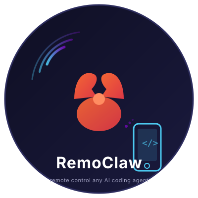
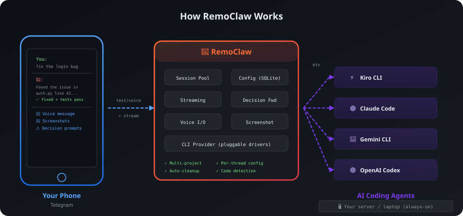
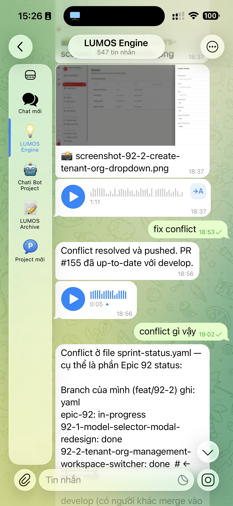
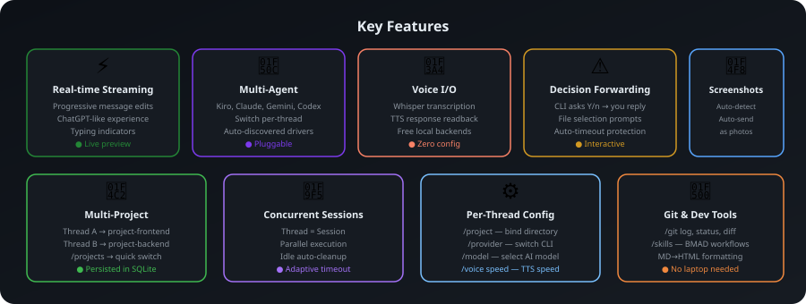

# 🦞 RemoClaw

<p align="center">
  
</p>

<p align="center">
  <strong>Remote control any AI coding agent from your phone.</strong>
</p>

<p align="center">
  <a href="LICENSE"></a>
  
  
  
</p>

<p align="center">
  <strong>English</strong> ·
  <a href="README.vi.md">Tiếng Việt</a>
</p>

<p align="center">
  <a href="docs/usage.md">Usage</a> ·
  <a href="docs/voice.md">Voice</a> ·
  <a href="docs/architecture.md">Architecture</a> ·
  <a href="docs/deployment-guide.md">Deployment</a> ·
  <a href="docs/development-guide.md">Contributing</a>
</p>

---

## What is RemoClaw?

Your AI coding agents (Kiro, Claude Code, Gemini, Codex) live on your dev machine. RemoClaw makes them controllable from your phone — over Telegram, with streaming responses, voice in/out, and decision forwarding.

**Use it when:**

- 🛋️ Reviewing a PR from the couch
- 🚌 Triaging a bug on the bus
- 🎤 Pair-programming hands-free while cooking
- 🔀 Juggling multiple projects across separate threads

## How it works

<p align="center">
  
</p>

You send a message on Telegram → RemoClaw forwards it to the AI agent on your dev machine → the agent's response streams back to your phone in real-time. Voice messages, decision prompts (Y/n), and screenshots all flow through the same pipe.

For technical details, see the [architecture doc](docs/architecture.md).

<p align="center">
  
</p>

## Quick start

```bash
git clone https://github.com/quangtam/remoclaw.git
cd remoclaw
bash setup.sh           # Windows: setup.bat
./remoclaw start        # Windows: remoclaw start
```

The setup wizard handles Python venv, dependencies, Telegram token, and `.env`. After it finishes, login your CLI once (`kiro-cli login` / `claude login` / `gemini auth` / `codex login`) and start chatting.

> Need manual setup or more control? See the [deployment guide](docs/deployment-guide.md).

## Supported agents

| Agent | Auth |
| ----- | ---- |
| [Kiro CLI](docs/setup-kiro.md) | `kiro-cli login` |
| [Claude Code](docs/setup-claude.md) | `claude login` |
| [Gemini CLI](docs/setup-gemini.md) | `gemini auth` |
| [OpenAI Codex](docs/setup-codex.md) | `codex login` |

All agents authenticate via browser login on the host machine. RemoClaw uses the local session — **no API keys required** for the agent itself.

## Features

<p align="center">
  
</p>

- 📡 **Multi-agent** — pluggable drivers for Kiro, Claude Code, Gemini, Codex
- ⚡ **Real-time streaming** — progressive message edits, ChatGPT-like UX
- 🎤 **Voice in/out** — Whisper transcription + TTS readback, free local backends
- 📂 **Multi-project** — bind threads to different project directories, switch with `/projects`
- ⚠️ **Decision forwarding** — CLI Y/n prompts piped to chat, your reply piped back
- 📸 **Screenshot auto-forward** — image paths in CLI output sent as Telegram photos
- 🧵 **Concurrent sessions** — multiple threads run in parallel, idle auto-cleanup
- 💾 **Persistent config** — thread bindings and preferences survive bot restarts

## Common commands

```text
/help                    Full command reference
/info                    Current session details
/sessions                List all active sessions
/project /path/to/repo   Bind thread to a project
/provider claude         Switch CLI provider
/voice                   Toggle voice output
/git status              Run git status on the project
```

Full reference → [`docs/usage.md`](docs/usage.md).

## Documentation

| Topic | Doc |
| ----- | --- |
| Usage & all commands | [docs/usage.md](docs/usage.md) |
| Voice configuration | [docs/voice.md](docs/voice.md) |
| Architecture | [docs/architecture.md](docs/architecture.md) |
| Deployment (systemd, Docker) | [docs/deployment-guide.md](docs/deployment-guide.md) |
| Add a new CLI provider | [docs/development-guide.md](docs/development-guide.md) |

## Limitations

- Single bot instance per Telegram token (409 Conflict otherwise)
- Voice speed control is most precise on OpenAI TTS; edge-tts uses rate-percent mapping
- AI IDEs without a headless CLI (Cursor, Windsurf, VS Code) aren't supported yet — RemoClaw bridges to CLI agents

## License

[MIT](LICENSE) — free to use, modify, and distribute.
